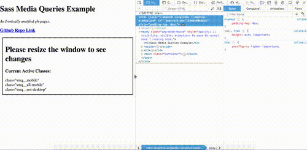

# sass-media-queries

[](https://badge.fury.io/js/sass-media-queries)



Sass Importable Media Queries. Can be used as a class, or as a mixin. All mixins and classes are prepended with `smq__`. This follows BEM naming methodologies.

[Github Pages Demo](https://torch2424.github.io/sass-media-queries/).
[NPM Module Link](https://www.npmjs.com/package/sass-media-queries).

## Usage

Install to the project:

```
npm install --save sass-media-queries
```

Simply import at the top of a sass file to get going:

```scss
@import './node_modules/sass-media-queries/index.scss';

// Other Sass down here...
```

Before we can start using the library, let's understand the defined widths:

```
$mobile-width: 320px;
$tablet-width: 768px;
$desktop-width: 1024px;
$large-desktop-width: 1440px;
```

With these in mind, here are the available classes and mixins:

`@include smq__mobile or class="smq__mobile"` - Show only on mobile devices


`@include smq__tablet or class="smq__tablet"` - Show only on tablet devices


`@include smq__desktop or class="smq__desktop"` - Show only on desktop devices


`@include smq__large-desktop or class="smq__large-desktop"` - Show only on large-desktop devices


`@include smq__all-mobile or class="smq__all-mobile"` - Show only on mobile and tablet devices


`@include smq__not-mobile or class="smq__not-mobile"` - Show only on desktop and large desktop devices


`@include smq__all-desktop or class="smq__all-desktop"` - Show only on desktop and large desktop devices


`@include smq__not-desktop or class="smq__not-desktop"` - Show only on mobile and tablet devices


## Example

In HTML on an element:

```html
<div class="smq__all-mobile">
  🖥️ You won't see me on desktop! 🖥️
</div>
```

As a mixin in Sass:

```sass
.my-awesome-class {
  display: block;
  color: blue;

  @include smq__not-mobile {
    display: none;
  }
}
```

## Contributing

Clone the project:

```
git clone https://github.com/torch2424/sass-media-queries.git
```

Install devDependencies:

```
npm install
```

Run the command: `npm run build`, to continuously see changes to the `index.html` in the `docs` folder. Sorry, but no livereload or watch is set up for this (Since it's just a simple little package).

## LICENSE

[MIT](https://choosealicense.com/licenses/mit/#)
